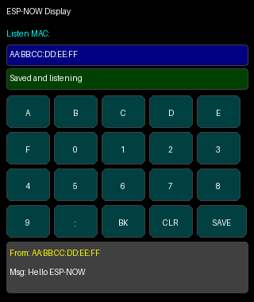

# ESPNow-Display

ESP32 CYD 4" touchscreen sketch that:
- receives and displays ESP-NOW messages,
- provides an on-screen keyboard to enter a sender MAC address filter,
- saves the selected MAC address in NVS so it survives power cycles.

## UI preview

## Sketch
- `ESPNow-Display.ino`

## Required Arduino libraries
Install these from Library Manager:
- `TFT_eSPI`
- `XPT2046_Touchscreen`

(ESP32 core already provides `WiFi.h`, `esp_now.h`, and `Preferences.h`.)

## Hardware notes
Default touch pin macros in the sketch are:
- `TOUCH_CS_PIN = 33`
- `TOUCH_IRQ_PIN = 36`

If your CYD variant uses different pins or calibration values, adjust these compile-time macros in the sketch:
- `TOUCH_CS_PIN`, `TOUCH_IRQ_PIN`
- `TOUCH_RAW_X_MIN`, `TOUCH_RAW_X_MAX`
- `TOUCH_RAW_Y_MIN`, `TOUCH_RAW_Y_MAX`

## Usage
1. Flash `ESPNow-Display.ino` to your ESP32 CYD.
2. Use the on-screen keyboard to type a MAC in `AA:BB:CC:DD:EE:FF` format.
3. Press **SAVE**.
4. Incoming ESP-NOW messages from that sender are shown in the message panel.
5. The saved MAC is automatically restored on reboot.
